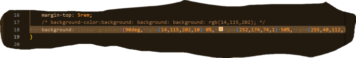

# Enjoy the Microblog Project and the MicroblogLite API!

Don't forget to read the [*MicroblogLite* API docs](http://microbloglite.us-east-2.elasticbeanstalk.com/docs) and experiment with the API in *Postman!*

Practice and experimentation provide experience, and experience provides confidence.

This project is about making a functional walled-in-garden website!

Our favorite lines of code!

Abigail's favorite code she wrote:

Eshet's favorite code he wrote: 

Cymone's favorite code she wrote:

Elora's favorite code she wrote:

